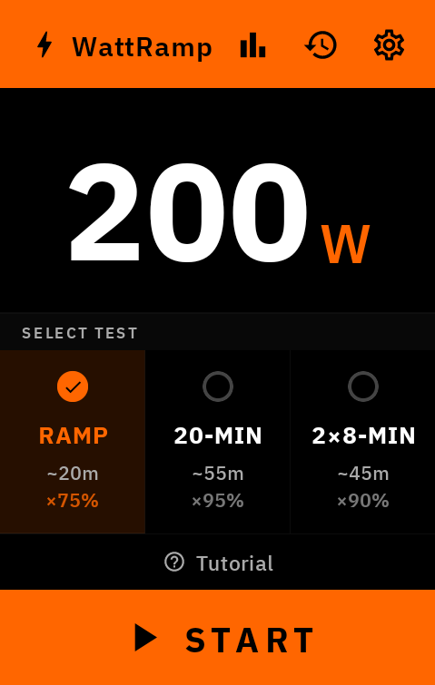
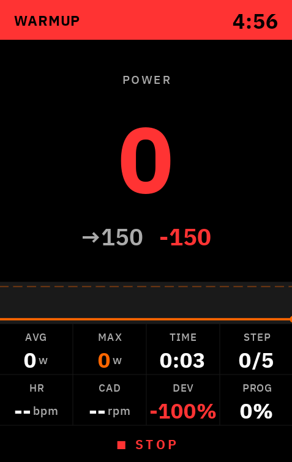
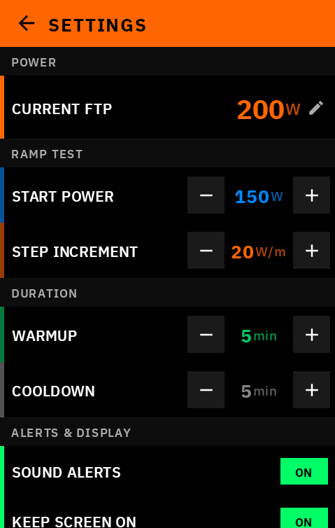

# WattRamp

[](LICENSE)
[](https://www.hammerhead.io/)
[](https://github.com/yrkan/wattramp/releases)
[](https://github.com/yrkan/wattramp/releases/latest)
[](https://wattramp.com)

Free FTP testing extension for Hammerhead Karoo cycling computers. No subscriptions, no accounts, works completely offline.

<p align="center">
  &nbsp;&nbsp;
  &nbsp;&nbsp;
  &nbsp;&nbsp;
  
</p>

## Features

### Three FTP Test Protocols

| Protocol | Duration | Best For | Formula |
|----------|----------|----------|---------|
| **Ramp Test** | ~20 min | Quick assessment, time-crunched athletes | Max 1-min × 0.75 |
| **20-Minute Test** | ~60 min | Gold standard, accurate results | 20-min avg × 0.95 |
| **8-Minute Test** | ~50 min | Balance of accuracy and time | Avg of two 8-min × 0.90 |

### Real-time Data Fields

9 data fields available for your ride screen:

| Field | Size | Description |
|-------|------|-------------|
| **Current Interval** | 2x1 | Graphical widget with interval name, target power, progress bar |
| **Target Power** | 1x1 | Current target wattage or "MAX" for max effort intervals |
| **Test Progress** | 1x1 | Step number (Ramp) or percentage complete |
| **Power Zone** | 1x1 | Zone indicator: IN ZONE / TOO LOW / TOO HIGH |
| **Deviation** | 1x1 | Watts above/below target (e.g., +15W, -8W) |
| **Elapsed Time** | 1x1 | Total test duration |
| **Average Power** | 1x1 | Session average power |
| **Max Power** | 1x1 | Session maximum power |
| **FTP Prediction** | 1x1 | Live FTP estimate (updates during Ramp test) |

### Extended Analytics

Results include advanced metrics:
- **Normalized Power (NP)**: Accounts for variability in effort
- **Variability Index (VI)**: NP / Avg Power (1.0 = steady, >1.05 = variable)
- **Efficiency Factor (EF)**: NP / Avg HR (tracks aerobic fitness)

### Power Zones

WattRamp calculates 7 power zones based on your FTP:

| Zone | Name | % FTP | Purpose |
|------|------|-------|---------|
| Z1 | Active Recovery | &lt;55% | Easy spinning, recovery rides |
| Z2 | Endurance | 55-75% | Long base miles, fat burning |
| Z3 | Tempo | 75-90% | Sustained moderate effort |
| Z4 | Threshold | 90-105% | FTP work, race pace |
| Z5 | VO2max | 105-120% | Hard intervals, 3-8 min efforts |
| Z6 | Anaerobic | 120-150% | Short bursts, 30s-2min |
| Z7 | Neuromuscular | &gt;150% | Sprints, max power |

### FTP History & Charts

- **Progress Tracking**: View all past test results with detailed analytics
- **Chart Modes**: Toggle between Bar, Trend (smooth Bézier curves), and Protocol comparison views
- **Statistics**: Best FTP, average, total gain, test count

### Pre-Test Checklist

Dedicated checklist screen before each test:
- Calibrate power meter
- Sensors connected
- Hydration ready
- FTP setting verified

### Interactive Tutorial

8-page tutorial accessible from Home Screen → Tutorial link:

| Page | Topic | Content |
|------|-------|---------|
| 1 | What is FTP? | Definition, why it matters, benefits of testing |
| 2 | Ramp Test | Protocol explanation with visual diagram |
| 3 | 20-Minute Test | Classic protocol with timeline visualization |
| 4 | 2×8-Minute Test | Dual effort protocol diagram |
| 5 | Power Zones | All 7 zones with colors and descriptions |
| 6 | During the Test | Screen layout guide with callouts |
| 7 | Understanding Results | NP, VI, EF, W/kg explained |
| 8 | Tips for Success | Best practices for accurate testing |

### App Guide Tour

Interactive walkthrough accessible from Settings → Guide:
- Step-by-step tour of all screens (Home, Settings, History, Zones, Running, Results)
- Explains test protocols, settings, and results
- Perfect for first-time users
- Tap anywhere to advance through the guide

### Session Recovery

If the app crashes during a test, WattRamp detects the abandoned session on restart and offers to dismiss or discard it.

### In-Ride Alerts

- **Interval Changes**: Visual + audio notification when phases change
- **Countdown Warnings**: 30-second and 10-second warnings before transitions
- **Motivational Messages**: "HALFWAY!", "PUSH HARDER!" encouragement
- **Low Cadence Warning**: Alert when cadence drops below optimal range
- **Test Completion**: Final FTP result with comparison to previous

### Sound Alerts

Audible beep patterns using Karoo's internal beeper:
- Single beep: Interval changes
- Double beep: Test start / completion
- Triple beep: Final 30 seconds

## Installation

### From GitHub Releases (Recommended)

1. Download `wattramp-x.x.x.apk` from [Releases](https://github.com/yrkan/wattramp/releases)
2. Transfer to Karoo using one of these methods:

   **Option A: USB Cable (Simplest)**
   - Connect Karoo to computer via USB cable
   - Enable file transfer mode on Karoo
   - Copy APK to any folder on Karoo
   - On Karoo: open Files app → navigate to APK → tap to install

   **Option B: ADB Wireless (No Cable)**
   - Enable Developer Options on Karoo (Settings → About → tap Build Number 7 times)
   - Enable ADB Debugging and note IP address
   - From computer: `adb connect <karoo-ip>:5555`
   - Install: `adb install wattramp-x.x.x.apk`

   **Option C: Web Server**
   - Upload APK to any web server or cloud storage
   - On Karoo: open web browser, download APK, tap to install

3. Launch WattRamp from app drawer

### Build from Source

**Requirements:**
- Android Studio Arctic Fox+ or JDK 17+
- Gradle 8.x

**Setup GitHub Packages access** (Karoo SDK requires authentication):

1. Create [GitHub Personal Access Token](https://github.com/settings/tokens) with `read:packages` scope
2. Add to `~/.gradle/gradle.properties`:
```properties
gpr.user=YOUR_GITHUB_USERNAME
gpr.key=YOUR_GITHUB_TOKEN
```

**Build:**
```bash
git clone https://github.com/yrkan/wattramp.git
cd wattramp
./gradlew assembleRelease
```

APK: `app/build/outputs/apk/release/wattramp-x.x.x.apk`

## Usage Guide

### Initial Setup

1. **Open WattRamp** on your Karoo
2. **Set your current FTP** (used for warmup/recovery zone calculations)
3. **Configure test parameters** (optional):
   - Ramp start power (default: 100W)
   - Ramp step increment (default: 20W/min)
   - Warmup/cooldown duration
   - Sound and screen wake preferences

### Adding Data Fields

1. Go to **Profiles** → Select your ride profile → **Edit**
2. Add a new page or edit existing
3. Tap empty slot → **More Data** → **WattRamp**
4. Select desired fields (recommended: Current Interval 2x1 + 2-3 numeric fields)

### Running a Test

1. **Start a ride** (WattRamp requires an active recording)
2. **Open WattRamp app** during ride
3. **Select test protocol** (Ramp / 20-min / 8-min)
4. **Follow the intervals**:
   - Watch target power on data fields
   - Stay in zone (green = good, red = too low/high)
   - Listen for audio cues
5. **Complete the test**:
   - Ramp: Continue until you can't maintain power (auto-detects failure)
   - 20-min / 8-min: Follow all intervals to completion
6. **View results** and optionally save to history

### Test Protocol Details

#### Ramp Test
```
[5 min Warmup @ 50%] → [Ramp: +20W every minute until failure] → [5 min Cooldown]
```
- Starts at configurable power (default 100W)
- Increases by configurable step (default 20W) every minute
- Auto-ends when power drops >30% below target for 10+ seconds
- FTP = Max 1-minute average × 0.75

#### 20-Minute Test
```
[20 min Warmup] → [5 min Blow-out @ 105%] → [5 min Recovery] → [20 min MAX EFFORT] → [10 min Cooldown]
```
- Classic protocol for accurate FTP measurement
- Requires pacing strategy for 20-min effort
- FTP = 20-minute average × 0.95

#### 8-Minute Test
```
[15 min Warmup] → [8 min MAX #1] → [10 min Recovery] → [8 min MAX #2] → [10 min Cooldown]
```
- Two efforts allow for pacing adjustment
- Average of both efforts used
- FTP = Average of two 8-min efforts × 0.90

## Settings

| Setting | Description | Default | Range |
|---------|-------------|---------|-------|
| **Current FTP** | Your baseline FTP for zone calculations | 200W | 50-500W |
| **Ramp Start Power** | Initial power for ramp test | 150W | 50-300W |
| **Ramp Step** | Power increase per minute | 20W | 10-50W |
| **Warmup Duration** | Warmup period length | 5 min | 1-15 min |
| **Cooldown Duration** | Cooldown period length | 5 min | 1-15 min |
| **FTP Calculation Method** | Conservative (0.72) / Standard / Aggressive (0.77) | Standard | — |
| **Sound Alerts** | Enable beep notifications | On | — |
| **Screen Wake** | Wake screen on important alerts | On | — |
| **Motivational Messages** | Show encouragement during test | On | — |
| **Language** | UI language | System | — |
| **Theme** | Orange or Blue color scheme | Orange | — |

## Architecture

```
io.github.wattramp/
├── WattRampExtension.kt     # KarooExtension service entry point
├── MainActivity.kt          # Settings UI (Jetpack Compose)
├── MainViewModel.kt         # State management for UI
├── datatypes/               # 9 Karoo data field implementations
│   ├── CurrentIntervalDataType.kt  # 2x1 graphical widget
│   ├── TargetPowerDataType.kt
│   ├── TestProgressDataType.kt
│   └── ...
├── protocols/               # FTP test protocol implementations
│   ├── TestProtocol.kt      # Base interface + common logic
│   ├── RampTest.kt
│   ├── TwentyMinTest.kt
│   └── EightMinTest.kt
├── engine/
│   ├── TestEngine.kt        # State machine, Karoo stream handling
│   ├── TestState.kt         # Sealed class for test states
│   ├── AlertManager.kt      # In-ride alert management
│   └── AnalyticsCalculator.kt  # NP, VI, EF calculations
├── data/
│   ├── PreferencesRepository.kt  # DataStore persistence
│   ├── TestHistory.kt       # Test result storage
│   └── TestSession.kt       # Session recovery data
└── ui/
    ├── screens/             # Compose UI screens
    │   ├── HomeScreen.kt         # Protocol selection, FTP display
    │   ├── ChecklistScreen.kt    # Pre-test checklist
    │   ├── SensorWarningScreen.kt # Power meter warning
    │   ├── RunningScreen.kt      # Active test display
    │   ├── ResultScreen.kt       # Test results
    │   └── ...
    └── components/          # Reusable UI (charts, guide tour)
```

### Key Technical Details

- **Thread Safety**: All shared state uses `AtomicInteger`, `AtomicLong`, `AtomicReference`, and `Mutex`
- **Memory Management**: Bounded data structures prevent unbounded growth (max 4000 power samples)
- **Karoo SDK**: Uses `KarooSystemService` for power/HR/cadence streams, alerts, and beeps
- **State Flow**: Reactive state management with Kotlin `StateFlow`

## Troubleshooting

### Data fields show "--" or 0
- Ensure a ride is actively recording
- Start a test from the WattRamp app
- Check that power meter is connected

### No sound alerts
- Verify "Sound Alerts" is enabled in settings
- Check Karoo system volume
- Some older Karoo firmware may have beeper limitations

### Test doesn't auto-end (Ramp)
- Power must drop >30% below target for 10+ consecutive seconds
- Ensure power meter is transmitting consistently
- You can manually stop via the app if needed

### FTP seems too high/low
- Try different calculation methods in settings (Conservative/Aggressive)
- Ensure you gave maximum effort during test intervals
- Compare with other FTP tests for validation

### History not showing tests
- Tests are only saved when you tap SAVE on the result screen
- Maximum 100 tests stored (oldest removed when exceeded)
- Clear History in Settings will remove all tests

### App closes unexpectedly
- Session recovery will detect abandoned tests on next launch
- Check for low battery or overheating
- Try reinstalling from latest release

## Supported Languages

WattRamp is fully translated into 10 languages:

| Language | Code | Status |
|----------|------|--------|
| English | en | ✅ Complete (231 strings) |
| German | de | ✅ Complete |
| Spanish | es | ✅ Complete |
| French | fr | ✅ Complete |
| Italian | it | ✅ Complete |
| Japanese | ja | ✅ Complete |
| Dutch | nl | ✅ Complete |
| Portuguese | pt | ✅ Complete |
| Russian | ru | ✅ Complete |
| Chinese (Simplified) | zh-CN | ✅ Complete |

Language is automatically detected from your Karoo system settings, or can be changed manually in WattRamp Settings → Language.

## Requirements

- **Device**: Hammerhead Karoo 2 or Karoo 3
- **Sensors**: Power meter (required)
- **Optional**: Heart rate monitor (for HR zone display and EF calculation)

## Privacy

WattRamp respects your privacy:

- **100% Offline**: No internet connection required or used
- **Local Storage Only**: All data stays on your device
- **No Accounts**: No registration, login, or cloud sync
- **No Analytics**: Zero tracking or telemetry
- **Open Source**: Verify everything yourself

## Changelog

### v1.5.1
- **Localization Sync**: All 10 languages now have identical string keys (231 strings each)
- **String Cleanup**: Fixed missing translations for analytics metrics (NP, VI, EF, HR) in all locales
- **About Section**: Added version, GitHub, Privacy, Contact links to Settings
- **Protocol Cards**: Consistent localized short names across all languages

### v1.5.0
- **HomeScreen Redesign**: Compact Garmin Edge-style layout
  - Hero FTP display (large centered value)
  - Horizontal protocol selector (RAMP / 20-MIN / 2×8-MIN)
  - Clean visual hierarchy
- **Navigation Improvements**: Fixed screen flickering during transitions
  - Unified navigation using popBackStack
  - Separated LaunchedEffects for different state changes
  - Proper state cleanup on test stop
- **Pre-Test Checklist**: Dedicated full-screen checklist before test
- **Sensor Warning Screen**: Clear warning when power meter not detected
- **App Guide Tour**: Interactive walkthrough of all screens (Settings → Guide)
- **Translation Updates**: Complete synchronization of all 10 languages
- **UI Polish**: Better spacing, typography, and touch targets

### v1.4.0
- **Extended Analytics**: NP, Variability Index, Efficiency Factor in results
- **FTP History Charts**: Bar, Trend (Bezier curves), Protocol comparison modes
- **Pre-Test Checklist**: Expandable reminder on home screen
- **Session Recovery**: Detects abandoned tests after crash/restart
- Shows up to 12 results in history (was 8)

### v1.3.1
- Fixed KarooSystem connection check before starting test
- Added settings validation with min/max bounds
- Changed default ramp start to 150W (was 100W)
- Thread-safe update job handling
- Fixed UserProfile FTP logic

### v1.3.0
- Thread safety improvements for Karoo 3 stability
- Implemented sound alerts (PlayBeepPattern)
- Fixed HR zones using actual user max HR from profile
- Fixed progress calculation for 20-min and 8-min tests
- Memory optimization with bounded data structures
- R8 minification (APK size: 17MB → 2.1MB)

### v1.2.2
- Added configurable warmup/cooldown duration
- Karoo settings integration

### v1.2.1
- Registered all 9 data types
- Localization fixes

### v1.2.0
- Performance improvements
- Added MainViewModel for state management

## Contributing

Contributions welcome! Please:

1. Fork the repository
2. Create feature branch (`git checkout -b feature/amazing-feature`)
3. Commit changes (`git commit -m 'Add amazing feature'`)
4. Push to branch (`git push origin feature/amazing-feature`)
5. Open Pull Request

## Support

- **Issues**: [GitHub Issues](https://github.com/yrkan/wattramp/issues)
- **Discussions**: [GitHub Discussions](https://github.com/yrkan/wattramp/discussions)

## License

MIT License — see [LICENSE](LICENSE) file.

## Acknowledgments

- Built with [Karoo Extension SDK](https://github.com/hammerheadnav/karoo-ext)
- FTP protocols based on established cycling science (Coggan, Allen, Friel)

---

**Disclaimer**: WattRamp is an independent project, not affiliated with Hammerhead or SRAM. Karoo is a trademark of Hammerhead.
